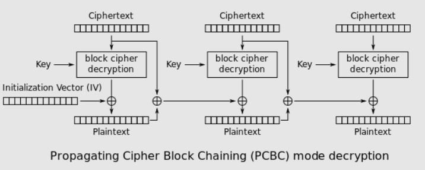

# KMA CTF 2021 - Cryptography

## Ciphers
> Caesar cipher and Affine cipher aren't safe enough, how about Caesar-then-Affine?

chall.py
```python
from Crypto.Util.number import getPrime
from random import randint
from flag import FLAG

assert FLAG.startswith(b"KMA{") and FLAG.endswith(b"}")
n = getPrime(32)

def caesar_affine(msg, key):
    ct = []
    for m in msg:
        c = (m + key[0]) % n
        c = (key[1]*c + key[2]) % n
        ct.append(c)
    return ct

enc = list(FLAG)
for i in range(32):
    key = (randint(1,n), randint(1,n-1), randint(1,n))
    enc = caesar_affine(enc, key)

#print(n) :)
print(enc)

# [3672812146, 1322164696, 3179556757, 325408115, 451283413, 83903322, 1626607138, 388345764, 1070414100, 1007476451, 1626607138, 1689544787, 577158711, 1689544787, 3358123901, 4040192237, 2738993214, 2676055565, 1007476451, 388345764, 1070414100, 2749239017, 3358123901, 577158711, 451283413, 3179556757, 2676055565, 577158711, 3358123901, 3053681459, 388345764, 577158711, 1070414100, 3358123901, 4040192237, 2738993214, 1689544787, 2308675474, 1563669489, 2560426070, 577158711, 2434550772, 1689544787, 4040192237, 3295186252, 2738993214, 1070414100, 388345764, 2676055565, 2056924878]
```

Khi mã hóa Affine một bản rõ `m` hai lần với khóa khác nhau lần lượt là (a1,b1) và (a2,b2) thu được `c = a2*(a1*m + b1) + b2 = (a1*a2)*m + (a2*b1 + b2) (mod n)`.

Có thể thấy hai lần Affine sẽ thành một lần Affine khác với `a' = a1*a2, b' = a2*b1 + b2`; do gcd(a1,n) = gcd(a2,n) = 1 (điều kiện mã Affine gcd(a,n) = 1) nên gcd(a1*a2,n) cũng bằng 1. Caesar cũng là mã Affine với a = 1 nên challenge trở thành một lần Affine, `c = A*m + B mod n`, hidden n, A, B.

Biết được bản mã tương ứng của `KMA{}` là [3672812146, 1322164696, 3179556757, 325408115, 2056924878].

Đặt m' và c' là hiệu của hai cặp (m,c) bất kì, `m' = m_i - m_j, c' = c_i - c_j, nên c' = A * m' (mod n)`.

Nếu có 2 phương trình:
```
A * m1' = c1' (mod n); A * m2' = c2' (mod n)
A * m1' * m2' = c1' * m2' (mod n); A * m2' * m1' = c2' * m1' (mod n); Nhân hai vế của từng phương trình.
0 = c1' * m2' - c2' * m1' (mod n); Trừ hai phương trình với nhau.
```

`Factor(c1' * m2' - c2' * m1')` sẽ tìm được n. Sau khi có n, tính `A = c'*m'^-1 (mod n), B = c - A*m (mod n)`. Dùng n, A, B giải mã phần còn lại của flag.
```python
>>> m = list(b'KMA{}')
>>> c = [3672812146, 1322164696, 3179556757, 325408115, 2056924878]
>>> (c[0]-c[1])*(m[2]-m[3]) - (c[2]-c[3])*(m[0]-m[1])
-130629254816
>>> # Factor(-130629254816) = -1 * 2^5 * 4082164213, n = 4082164213.
>>> n = 4082164213
>>> A = (c[0]-c[1])*pow(m[0]-m[1], -1, n) % n
>>> B = (c[0] - A*m[0]) % n
>>> c = [3672812146, 1322164696, 3179556757, 325408115, 451283413, 83903322, 1626607138, 388345764, 1070414100, 1007476451, 1626607138, 1689544787, 577158711, 1689544787, 3358123901, 4040192237, 2738993214, 2676055565, 1007476451, 388345764, 1070414100, 2749239017, 3358123901, 577158711, 451283413, 3179556757, 2676055565, 577158711, 3358123901, 3053681459, 388345764, 577158711, 1070414100, 3358123901, 4040192237, 2738993214, 1689544787, 2308675474, 1563669489, 2560426070, 577158711, 2434550772, 1689544787, 4040192237, 3295186252, 2738993214, 1070414100, 388345764, 2676055565, 2056924878]
>>> flag = bytes([(i-B)*pow(A,-1,n) % n for i in c])
>>> flag
b'KMA{mUltiple_encrypti0n_mAy_nOt_increasE_Security}'
```

## Free Flag
> It's really a free flag, you need only ask.

chall.py
```python
from Crypto.Cipher import AES
from Crypto.Util.Padding import pad, unpad
from os import urandom
from flag import FLAG


def xor(x,y):
        return bytes([a^b for a,b in zip(x,y)])

class Challenge:
    def __init__(self, key):
        self.key = key
        self.message = b"Hi, I'm here for the flag, plz give it to me."
        self.cipher = AES.new(self.key, AES.MODE_ECB)

    def encrypt(self, plaintext):
        plaintext = bytes(16) + pad(plaintext, 16)
        ciphertext = urandom(16) # IV
        for i in range(16,len(plaintext),16):
            tmp = xor(xor(plaintext[i:i+16], plaintext[i-16:i]), ciphertext[i-16:i])
            tmp = self.cipher.encrypt(tmp)
            ciphertext += tmp
        return ciphertext
    
    def decrypt(self, ciphertext):
        plaintext = bytes(16)
        for i in range(16,len(ciphertext),16):
            tmp = self.cipher.decrypt(ciphertext[i:i+16])
            plaintext += xor(xor(tmp, plaintext[i-16:i]), ciphertext[i-16:i])
        plaintext = plaintext[16:]

        try:
            plaintext = unpad(plaintext,16)
            if plaintext == self.message:
                return FLAG
            else:
                return "Try again."
        except Exception as e:
            return e

if __name__ == "__main__":
    chall = Challenge(urandom(16))
    while True:
        try:
            ciphertext = bytes.fromhex(input())
            assert len(ciphertext) % 16 == 0 and len(ciphertext) >= 32
            print(chall.decrypt(ciphertext))
        except:
            break
```
Bài yêu cầu nhập `ciphertext`, nếu decrypt `ciphertext` là `"Hi, I'm here for the flag, plz give it to me."` thì gửi `flag`, nếu padding sai sẽ gửi thông báo lỗi, padding đúng thì gửi `Try again`.

[Padding oracle attack](https://en.wikipedia.org/wiki/Padding_oracle_attack)

PCBC mode decryption - Wikipedia



Như vậy phải construct bản mã cho `message` b"Hi, I'm here for the flag, plz give it to me.\x03\x03\x03" khi đã thêm padding, chia thành 3 AES block mỗi block 16 byte.
```
Hi, I'm here for            (M1)
 the flag, plz g            (M2)
ive it to me.\x03\x03\x03   (M3)
```
Xét trường hợp bản mã chỉ gồm IV | C (với C là một block bản mã bất kì), có thể thay đổi IV để thực hiện padding oracle attack và tìm được bản rõ của C.

Để tìm bản mã của `message`, bắt đầu từ một block `C3` bất kì, padding oracle attack để tìm bản rõ của C3 là D(C3). Block `C2 = M2 XOR M3 XOR D(C3)`. Tương tự, padding oracle attack để tìm bản rõ của C2 là D(C2). Block `C1 = M1 XOR M2 XOR D(C2)`. Padding oracle attack thêm một lần nữa để tìm D(C1). `IV = M1 XOR D(C1)`. Bản mã cần tìm là `IV | C1 | C2 | C3`.

```python
from pwn import xor, remote
from Crypto.Util.Padding import pad, unpad
from os import urandom

r = remote('20.42.60.42', 9992)

msg = pad(b"Hi, I'm here for the flag, plz give it to me.",16)
ct = [urandom(16)]
for cnt in range(2,-1,-1):
    C = ct[-1]
    decrypted = []
    for c in range(1,17):
        print(c, end=' ')
        IV = list(bytes(16))
        for i in range(256):
            IV[-c] = i
            for j in range(1,c):
                IV[-j] = decrypted[-j] ^ c

            r.sendline((bytes(IV) + C).hex())
            res = r.recvuntil("\n",drop=True)
            if res == b"Try again.":
                print(i,res)
                decrypted = [i^c] + decrypted
                break
    if cnt != 0:
        ct.append(xor(xor(bytes(decrypted), msg[16*cnt:16*cnt+16]), msg[16*cnt-16:16*cnt]))
    else:
        ct.append(xor(bytes(decrypted), msg[16*cnt:16*cnt+16]))

ct = b''.join(ct[::-1])
r.sendline(ct.hex())
print(r.recvuntil("\n",drop="True"))
# KMA{P4ddIng_0r4clE_4tt4ck}
```

## Random Fault
> I've just found a weird signing server, but it seems broken. Can you get the flag?

chall.py
```python
from Crypto.Util.number import getStrongPrime
from random import getrandbits
from flag import FLAG
from os import urandom


class RSA:
    def __init__(self, p, q, e=65537):
        self.N = p*q
        self.e = e
        self.p = p
        self.q = q
        self.dp = pow(e, -1, p-1)
        self.dq = pow(e, -1, q-1)
        self.inv_q = pow(q, -1, p)

    def encrypt(self, m):
        return pow(m, self.e, self.N)

    def sign(self, m):
        Sp = pow(m, self.dp, self.p) if getrandbits(1) else pow(m, self.dp, self.p) | getrandbits(32)
        Sq = pow(m, self.dq, self.q) if getrandbits(1) else pow(m, self.dq, self.q) | getrandbits(32)
        S = Sq + self.q * (((Sp - Sq)*self.inv_q) % self.p)
        return S


if __name__ == "__main__":
    p = getStrongPrime(1024, e=65537)
    q = getStrongPrime(1024, e=65537)
    rsa = RSA(p, q)
    FLAG = int.from_bytes(urandom(245 - len(FLAG)) + FLAG, "big")
    for i in range(32):
        try:
            m = int(input("m: "))
            assert 1 < m < p*q
            print(rsa.sign(m))
        except:
            exit("Invalid input.")
    print(f"Encrypted flag: {rsa.encrypt(FLAG)}")
```

[RSA - Using the Chinese remainder algorithm](https://en.wikipedia.org/wiki/RSA_(cryptosystem)#Using_the_Chinese_remainder_algorithm)

Fault attack on RSA-CRT, bài yêu cầu gửi m (1 < m < n), trả về giá trị `m^d mod n` (sử dụng CRT). Lỗi xảy ra khi `getrandbits(1) = 0` nên Sp và Sq khi đúng khi sai.

Bảng dưới tóm tắt S trả về tương ứng với (Sp, Sp), cột thứ hai là giá trị `S mod p`, cột thứ ba là giá trị `S mod q`, và `Ŝ` là kí hiệu có lỗi xảy ra.

|       S     | mod p  | mod q  |
|-------------|--------|--------|
|S1 = (Sp, Sq)|  m^dp  |  m^dq  |
|S2 = (Sp, Ŝq)|  m^dp  |    -   |
|S3 = (Ŝp, Sq)|    -   |  m^dq  |
|S4 = (Ŝp, Ŝq)|    -   |    -   |

Giả sử gửi 32 `m` giống nhau, trong các kết quả trả về có 32 giá trị S, `(Sp, Sq)` có thể nhận biết được vì S1 cố định, xuất hiện nhiều lần.

Có `S1 - S2 = 0 (mod p)` và `S1 - S3 = 0 (mod q)`, nếu tìm được một cặp (S,S') sao cho S khác S', S và S' cùng là S2 hoặc cùng là S3 thì `gcd(|S1 - S|, |S1 - S'|)` có thể chứa một ước của n.

```python
from itertools import combinations
from pwn import remote
from Crypto.Util.number import *

r = remote('20.205.163.226', 9993)

s = []
for i in range(32):
    r.recvuntil("m: ")
    r.sendline("2")
    s.append(int(r.recvline().strip()))
r.recvuntil("Encrypted flag: ")
enc = int(r.recvline().strip())
r.close()

for i in s:
    if s.count(i) != 1:
        ss = i
        break

c = combinations(set(s),2)
primes = []
for i in c:
    tmp = GCD(abs(ss-i[0]), abs(ss-i[1]))
    if isPrime(tmp) and tmp.bit_length() > 1000 and tmp not in primes:
        primes.append(tmp)
        if len(primes) == 2:
            break

phi = (primes[0] - 1)*(primes[1] - 1)
d = pow(65537,-1,phi)
print(long_to_bytes(pow(enc,d,primes[0]*primes[1])))
# KMA{__fAulty_faUlty_SignaturE__}
```
