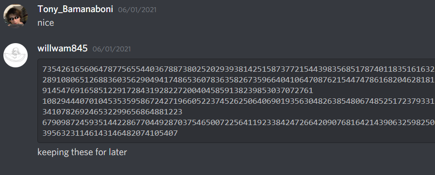

# corCTF 2021

**Contents**

- [fibinary](#fibinary)
- [4096](#4096)
- [dividing_secrets](#dividing_secrets)
- [supercomputer](#supercomputer)
- [babyrsa](#babyrsa)
- [babypad](#babypad)
- [babyrand](#babyrand)
- [LCG_k](#lcg_k)

***

## fibinary
> Author: quintec
> 
> Warmup your crypto skills with the superior number system!

enc.py
```python
fib = [1, 1]
for i in range(2, 11):
	fib.append(fib[i - 1] + fib[i - 2])

def c2f(c):
	n = ord(c)
	b = ''
	for i in range(10, -1, -1):
		if n >= fib[i]:
			n -= fib[i]
			b += '1'
		else:
			b += '0'
	return b

flag = open('flag.txt', 'r').read()
enc = ''
for c in flag:
	enc += c2f(c) + ' '
with open('flag.enc', 'w') as f:
	f.write(enc.strip())
```

flag.enc
```
10000100100 10010000010 10010001010 10000100100 10010010010 10001000000 10100000000 10000100010 00101010000 10010010000 00101001010 10000101000 10000010010 00101010000 10010000000 10000101000 10000010010 10001000000 00101000100 10000100010 10010000100 00010101010 00101000100 00101000100 00101001010 10000101000 10100000100 00000100100
```

Cho dãy Fibonacci `[1, 1, 2, 3, 5, 8, 13, 21, 34, 55, 89]`, các chữ của `flag` được mã hóa thành '1' hoặc '0' theo hệ số `[89, 55, 34, 21, 13, 8, 5, 3, 2, 1, 1]`. Tính tổng từng dãy bit để tìm lại `flag`.

```python
fib = [1, 1]
for i in range(2, 11):
	fib.append(fib[i - 1] + fib[i - 2])

enc = '10000100100 10010000010 10010001010 10000100100 10010010010 10001000000 10100000000 10000100010 00101010000 10010010000 00101001010 10000101000 10000010010 00101010000 10010000000 10000101000 10000010010 10001000000 00101000100 10000100010 10010000100 00010101010 00101000100 00101000100 00101001010 10000101000 10100000100 00000100100'.split(' ')
flag = ''
for c in enc:
    f = 0
    for i,j in zip(fib[::-1],c):
        if j == '1':
            f += i
    flag += chr(f)
print(flag)
# corctf{b4s3d_4nd_f1bp!113d}
```

***

## 4096
> Author: qopruzjf
> 
> I heard 4096 bit RSA is secure, so I encrypted the flag with it.

source.py
```python
from Crypto.Util.number import getPrime, bytes_to_long
from private import flag

def prod(lst):
	ret = 1
	for num in lst:
		ret *= num
	return ret

m = bytes_to_long(flag)
primes = [getPrime(32) for _ in range(128)]
n = prod(primes)
e = 65537
print(n)
print(pow(m, e, n))
```

output.txt
```
50630448182626893495464810670525602771527685838257974610483435332349728792396826591558947027657819590790590829841808151825744184405725893984330719835572507419517069974612006826542638447886105625739026433810851259760829112944769101557865474935245672310638931107468523492780934936765177674292815155262435831801499197874311121773797041186075024766460977392150443756520782067581277504082923534736776769428755807994035936082391356053079235986552374148782993815118221184577434597115748782910244569004818550079464590913826457003648367784164127206743005342001738754989548942975587267990706541155643222851974488533666334645686774107285018775831028090338485586011974337654011592698463713316522811656340001557779270632991105803230612916547576906583473846558419296181503108603192226769399675726201078322763163049259981181392937623116600712403297821389573627700886912737873588300406211047759637045071918185425658854059386338495534747471846997768166929630988406668430381834420429162324755162023168406793544828390933856260762963763336528787421503582319435368755435181752783296341241853932276334886271511786779019664786845658323166852266264286516275919963650402345264649287569303300048733672208950281055894539145902913252578285197293
15640629897212089539145769625632189125456455778939633021487666539864477884226491831177051620671080345905237001384943044362508550274499601386018436774667054082051013986880044122234840762034425906802733285008515019104201964058459074727958015931524254616901569333808897189148422139163755426336008738228206905929505993240834181441728434782721945966055987934053102520300610949003828413057299830995512963516437591775582556040505553674525293788223483574494286570201177694289787659662521910225641898762643794474678297891552856073420478752076393386273627970575228665003851968484998550564390747988844710818619836079384152470450659391941581654509659766292902961171668168368723759124230712832393447719252348647172524453163783833358048230752476923663730556409340711188698221222770394308685941050292404627088273158846156984693358388590950279445736394513497524120008211955634017212917792675498853686681402944487402749561864649175474956913910853930952329280207751998559039169086898605565528308806524495500398924972480453453358088625940892246551961178561037313833306804342494449584581485895266308393917067830433039476096285467849735814999851855709235986958845331235439845410800486470278105793922000390078444089105955677711315740050638
```

`n` là tích 128 số nguyên tố nhỏ (32 bit) nên có thể factor được.

```python
n = 50630448182626893495464810670525602771527685838257974610483435332349728792396826591558947027657819590790590829841808151825744184405725893984330719835572507419517069974612006826542638447886105625739026433810851259760829112944769101557865474935245672310638931107468523492780934936765177674292815155262435831801499197874311121773797041186075024766460977392150443756520782067581277504082923534736776769428755807994035936082391356053079235986552374148782993815118221184577434597115748782910244569004818550079464590913826457003648367784164127206743005342001738754989548942975587267990706541155643222851974488533666334645686774107285018775831028090338485586011974337654011592698463713316522811656340001557779270632991105803230612916547576906583473846558419296181503108603192226769399675726201078322763163049259981181392937623116600712403297821389573627700886912737873588300406211047759637045071918185425658854059386338495534747471846997768166929630988406668430381834420429162324755162023168406793544828390933856260762963763336528787421503582319435368755435181752783296341241853932276334886271511786779019664786845658323166852266264286516275919963650402345264649287569303300048733672208950281055894539145902913252578285197293
c = 15640629897212089539145769625632189125456455778939633021487666539864477884226491831177051620671080345905237001384943044362508550274499601386018436774667054082051013986880044122234840762034425906802733285008515019104201964058459074727958015931524254616901569333808897189148422139163755426336008738228206905929505993240834181441728434782721945966055987934053102520300610949003828413057299830995512963516437591775582556040505553674525293788223483574494286570201177694289787659662521910225641898762643794474678297891552856073420478752076393386273627970575228665003851968484998550564390747988844710818619836079384152470450659391941581654509659766292902961171668168368723759124230712832393447719252348647172524453163783833358048230752476923663730556409340711188698221222770394308685941050292404627088273158846156984693358388590950279445736394513497524120008211955634017212917792675498853686681402944487402749561864649175474956913910853930952329280207751998559039169086898605565528308806524495500398924972480453453358088625940892246551961178561037313833306804342494449584581485895266308393917067830433039476096285467849735814999851855709235986958845331235439845410800486470278105793922000390078444089105955677711315740050638
phi = euler_phi(n)
d = pow(65537,-1,phi)
flag = long_to_bytes(pow(c,d,n))
print(flag)
# corctf{to0_m4ny_pr1m3s55_63aeea37a6b3b22f}
```

***

## dividing_secrets
> Author: qopruzjf
> 
> I won't give you the secret. But, I'll let you divide it.
> 
> nc crypto.be.ax 6000

server.py
```python
from Crypto.Util.number import bytes_to_long, getStrongPrime
from random import randrange
from secret import flag

LIMIT = 64

def gen():
	p = getStrongPrime(512)
	g = randrange(1, p)
	return g, p

def main():
	g, p = gen()
	print("g:", str(g))
	print("p:", str(p))
	x = bytes_to_long(flag)
	enc = pow(g, x, p)
	print("encrypted flag:", str(enc))
	ctr = 0
	while ctr < LIMIT:
		try:
			div = int(input("give me a number> "))
			print(pow(g, x // div, p))
			ctr += 1
		except:
			print("whoops..")
			return
	print("no more tries left... bye")

main()
```

Bài cho số nguyên tố `p`, base `g`, cho phép 64 lần request `pow(g, x // div, p)`, với `x = bytes_to_long(flag)` và `div` là số người dùng nhập. Nếu div > x thì kết quả trả về sẽ là 1, dựa vào đây có thể xác định độ dài của flag (tính theo bit).

x^510 < x < 2^511, flag ~511 bit
```
g: 2890866139075533815558767444508906729954082233104164044250268332485617340899438514324847628501732149140139997756365570353178162897340539675312862631861758
p: 10068507912346519681525862407152318134311605527026774274587471206833175385754970736626181143072970609621422697603955386649811075466420089344433127459297717
encrypted flag: 5336811121964309080506897815274750461712575874727926254950306123525463143332131757792474365669941308937146592126502417474280440426132030107312570926120990
give me a number> 13407807929942597099574024998205846127479365820592393377723561443721764030073546976801874298166903427690031858186486050853753882811946569946433649006084096
1
give me a number> 6703903964971298549787012499102923063739682910296196688861780721860882015036773488400937149083451713845015929093243025426876941405973284973216824503042048
1
give me a number> 3351951982485649274893506249551461531869841455148098344430890360930441007518386744200468574541725856922507964546621512713438470702986642486608412251521024
2890866139075533815558767444508906729954082233104164044250268332485617340899438514324847628501732149140139997756365570353178162897340539675312862631861758
```

Giả sử tìm được k MSBs của flag, tìm bit thứ k+1 bằng cách đưa bit k+1 đó thành LSB của `x//div` rồi so sánh kết quả trả về với `pow(g, partialFlag*2, p)`.

```python
from pwn import remote
from Crypto.Util.number import long_to_bytes

def main():
    count = 510
    flag = '0'
    while True:
        print(count)
        r = remote("crypto.be.ax", 6000)
        g = int(r.recvline().split(b" ")[1].strip())
        p = int(r.recvline().split(b" ")[1].strip())
        for i in range(64):
            if count < 0:
                return flag
            r.recvuntil("give me a number> ")
            r.sendline(str(2**count))
            count -= 1
            x = int(r.recvline().strip())
            if x == pow(g,int(flag,2)*2,p):
                flag += '0'
            else:
                flag += '1'
        r.close()
if __name__ == "__main__":
    flag = main()
    print(long_to_bytes(int(flag,2)))
# corctf{qu4drat1c_r3s1due_0r_n0t_1s_7h3_qu3st1on8852042051e57492}
```

***

## supercomputer
> Author: quintec
> 
> I ran this code with a supercomputer from the future to encrypt the flag, just get your own and decryption should be simple!

supercomputer.py
```python
from Crypto.Util.number import getPrime, long_to_bytes
from pwn import *
import random, binascii

flag = open('flag.txt').read()

def v(p, k):
	ans = 0
	while k % p == 0:
		k /= p
		ans += 1
	return ans

p, q, r = getPrime(2048), getPrime(2048), getPrime(2048)
print(p, q, r)
n = pow(p, q) * r

a1 = random.randint(0, n)
a2 = n - a1
assert a1 % p != 0 and a2 % p != 0

t = pow(a1, n) + pow(a2, n)
print(binascii.hexlify(xor(flag, long_to_bytes(v(p, t)))))
```

output.txt
```
20936670545375210972091706288423179494163425035286134775773514440843943493090886819895346572945288304582498268271507942037581752184819846906869395551921930704321251130746547888224652316226957634541702883599286787839982090615950687496752999645558331533314682453610929822041558882012483238149288762974740347582024050756443700107245858419316423473568526347559377124536218894368962796664914408327949348396038507355935608178392088898784474582354438590711083089253977971653913217304360725716982473871023235180637867588860233011122300656470435644430602412710493441965130162664981423496370539240693045312454250776393871037539 19872523115298089612152987731023453644084277408261276810219001288407280019889227914287760742936580023163800626696116882213533508813201232707621762739857924392306902336092739272758773377952936022982446120177174082641600741522817135305633293579042208014735900229922142564590095968054337719254632703676737069746032384348392244892496672044899073391936273280270753785076044108870166304800552404013519058026991588856235381264192387525832530187004466616791531223421070547342377071358044704265893255021275811622959301157507095984825182110574434699593886509171425701861331576642311553357835312334349976576969220483604368671153 18342695102288954165224207958150786487860883752676419020596228714991017967256173183699487408637445601341687447489432163178271335469203559084363600703497940503946684342504933131623546315643648637992201226732630680112575643707020017139390225257319697353426087369722671485915571962910153169877358046375850132351117527591675467417925944135644417622440847857598273517926844822766083086147088819776687612745404553608100705862181700054385028096749375873889019995159762301115707945396140178370414857973922007665218670792403129624089144668480280115489465764431016721028424152163659378120333071194425845370101841510224643446231
b'6255a505b969be8175a5c578fd6e856ecd85faa1a22fdf38d2d11851211676fd3047ed12c4027e66ed2173495877180e3d49a387b74701fbbbdce00a2248c7812b157626c95e7cf5727ee90cc9a6a98d84ee50f106b11245d65b87a27bbd7ab94b0d82eeb6e49e81249ae880c150ff87d8da701e9d317932fa2b27b64eb894a112d942d7d269478a6c120be885f3fbd065c38e70498c2f294b47bb08da09fb63c05070248079fe4311c9821dd8d3a08b15f13cdb0b7a8d406790c4796e0218851b496a11bf1ad7575be6d9999d5f1c73080d724c66a116f865ffcd3048be5d59dae55a4a063629d30429765733521702ec36d3f111b015934d15d620ad0e35ee56'
```

Cho số nguyên tố p, q, r, `n = r*p^q`, a1 random, `a2 = n - a1`, `t = a1^n + a2^n`, v(p, t) là số mũ của p sau khi phân tích t. Flag được XOR với giá trị v(p, t). Như vậy phải tìm lại v(p, t).

Theo [Lifting-the-exponent lemma](https://en.wikipedia.org/wiki/Lifting-the-exponent_lemma), v(p, a1^n + a2^n) = v(p, a1 + a2) + v(p, n) = v(p, n) + v(p, n) = 2*q.

```python
>>> from Crypto.Util.number import long_to_bytes
>>> q = 19872523115298089612152987731023453644084277408261276810219001288407280019889227914287760742936580023163800626696116882213533508813201232707621762739857924392306902336092739272758773377952936022982446120177174082641600741522817135305633293579042208014735900229922142564590095968054337719254632703676737069746032384348392244892496672044899073391936273280270753785076044108870166304800552404013519058026991588856235381264192387525832530187004466616791531223421070547342377071358044704265893255021275811622959301157507095984825182110574434699593886509171425701861331576642311553357835312334349976576969220483604368671153
>>> ct = int(b'6255a505b969be8175a5c578fd6e856ecd85faa1a22fdf38d2d11851211676fd3047ed12c4027e66ed2173495877180e3d49a387b74701fbbbdce00a2248c7812b157626c95e7cf5727ee90cc9a6a98d84ee50f106b11245d65b87a27bbd7ab94b0d82eeb6e49e81249ae880c150ff87d8da701e9d317932fa2b27b64eb894a112d942d7d269478a6c120be885f3fbd065c38e70498c2f294b47bb08da09fb63c05070248079fe4311c9821dd8d3a08b15f13cdb0b7a8d406790c4796e0218851b496a11bf1ad7575be6d9999d5f1c73080d724c66a116f865ffcd3048be5d59dae55a4a063629d30429765733521702ec36d3f111b015934d15d620ad0e35ee56', 16)
>>> long_to_bytes(ct ^ 2*q)
b'corctf{1_b3t_y0u_d1dnt_4ctu411y_d0_th3_m4th_d1d_y0u?}\ncorctf{1_b3t_y0u_d1dnt_4ctu411y_d0_th3_m4th_d1d_y0u?}\ncorctf{1_b3t_y0u_d1dnt_4ctu411y_d0_th3_m4th_d1d_y0u?}\ncorctf{1_b3t_y0u_d1dnt_4ctu411y_d0_th3_m4th_d1d_y0u?}\ncorctf{1_b3t_y0u_d1dnt_4ctu411y_d0_th3_m4'
```

***

## babyrsa
> Author: willwam845
> 
> discord is the best place to store secrets



script.py
```python
from Crypto.Util.number import bytes_to_long

n = 73542616560647877565544036788738025202939381425158737721544398356851787401183516163221837013929559568993844046804187977705376289108065126883603562904941748653607836358267359664041064708762154474786168204628181667371305788303624396903323216279110685399145476916585122917284319282272004045859138239853037072761
e = 0x10001
flag = bytes_to_long(open("flag.txt", "rb").read())

print(f"n = {n}")
print(f"e = {e}")
print(f"ct = {pow(flag, e, n)}")
print("""
Transcription of image:
735426165606478775655440367887380252029393814251587377215443983568517874011835161632
289108065126883603562904941748653607836358267359664041064708762154474786168204628181
9145476916585122917284319282272004045859138239853037072761
108294440701045353595867242719660522374526250640690193563048263854806748525172379331
341078269246532299656864881223
679098724593514422867704492870375465007225641192338424726642090768164214390632598250
39563231146143146482074105407

(n, p, q)
""")
```

output.txt
```
n = 73542616560647877565544036788738025202939381425158737721544398356851787401183516163221837013929559568993844046804187977705376289108065126883603562904941748653607836358267359664041064708762154474786168204628181667371305788303624396903323216279110685399145476916585122917284319282272004045859138239853037072761
e = 65537
ct = 2657054880167593054409755786316190176139048369036893368834913798649283717358246457720021168590230987384201961744917278479195838455294205306264398417522071058105245210332964380113841646083317786151272874874267948107036095666198197073147087762030842808562672646078089825632314457231611278451324232095496184838

Transcription of image:
735426165606478775655440367887380252029393814251587377215443983568517874011835161632
289108065126883603562904941748653607836358267359664041064708762154474786168204628181
9145476916585122917284319282272004045859138239853037072761
108294440701045353595867242719660522374526250640690193563048263854806748525172379331
341078269246532299656864881223
679098724593514422867704492870375465007225641192338424726642090768164214390632598250
39563231146143146482074105407

(n, p, q)
```

So sánh n và n trong ảnh nhận thấy phần bên phải mỗi dòng bị mất 41 chữ, p và q cũng bị tương tự. Đặt `f(x) = H*10^71 + x*10^30 + L`, phương trình f(x) = 0 mod p có nghiệm là x (x < 10^41). Khi tìm được x sẽ tìm được p.

```python
from Crypto.Util.number import long_to_bytes

n = 73542616560647877565544036788738025202939381425158737721544398356851787401183516163221837013929559568993844046804187977705376289108065126883603562904941748653607836358267359664041064708762154474786168204628181667371305788303624396903323216279110685399145476916585122917284319282272004045859138239853037072761
e = 65537
ct = 2657054880167593054409755786316190176139048369036893368834913798649283717358246457720021168590230987384201961744917278479195838455294205306264398417522071058105245210332964380113841646083317786151272874874267948107036095666198197073147087762030842808562672646078089825632314457231611278451324232095496184838
H = 108294440701045353595867242719660522374526250640690193563048263854806748525172379331
L = 341078269246532299656864881223

F.<x> = PolynomialRing(Zmod(n))
f = H*10^71 + x*10^30 + L
z = f.monic().small_roots(beta=0.5)[0]
p = int(H*10^71 + z*10^30 + L)
assert n % p == 0
q = n//p
d = pow(e, -1, (p-1)*(q-1))
print(long_to_bytes(pow(ct,d,n)))
# corctf{1_w4s_f0rc3d_t0_wr1t3_ch4ll5_4nd_1_h4d_n0_g00d_1d345_pl5_n0_bully_;-;}
```

***

## babypad
> Author: willwam845
> 
> padding makes everything secure right
> 
> nc babypad.be.ax 1337
> 
> note: if you are finding that your exploit script is very slow, it is highly recommended to use a shell from meta/shell

server.py
```python
from Crypto.Cipher import AES
from Crypto.Util import Counter
from Crypto.Util.Padding import pad, unpad
from Crypto.Util.number import bytes_to_long
import os

flag = open("/challenge/flag.txt").read().encode()
key = os.urandom(16)

def encrypt(pt):
  iv = os.urandom(16)
  ctr = Counter.new(128, initial_value=bytes_to_long(iv))
  cipher = AES.new(key, AES.MODE_CTR, counter=ctr)
  return iv + cipher.encrypt(pad(pt, 16))

def decrypt(ct):
  try:
    iv = ct[:16]
    ct = ct[16:]
    ctr = Counter.new(128, initial_value=bytes_to_long(iv))
    cipher = AES.new(key, AES.MODE_CTR, counter=ctr)
    pt = cipher.decrypt(ct)
    unpad(pt, 16)
    return 1
  except Exception as e:
    return 0

def main():
  print(encrypt(flag).hex())
  while True:
   try:
    print(decrypt(bytes.fromhex(input("> "))))
   except Exception as e:
    pass

main()
```

Bit Flipping Attack on [CTR Mode](https://en.wikipedia.org/wiki/Block_cipher_mode_of_operation#Counter_(CTR)).

script
```python
from pwn import xor, remote

r = remote("babypad.be.ax", 1337)
ct = bytes.fromhex(r.recvline().strip().decode())
iv = ct[:16]
ct = ct[16:]

stream = [0]*16
enc = ct[:16]
for i in range(1,17):
    c1 = stream.copy()
    for j in range(1,i+1):
        c1[-j] = c1[-j] ^ i
    for j in range(256):
        c1[-i] = c1[-i] ^ j
        r.recv()
        r.sendline((iv+bytes(c1)).hex())
        ans = r.recvline().strip()
        if ans == b'1':
            stream[-i] = j
            break
        c1[-i] = c1[-i] ^ j
    #print(stream)
    print("flag:", xor(enc, bytes(stream)))
flag = xor(enc, bytes(stream))

stream = [0]*16
enc = ct[16:]
for i in range(1,17):
    c1 = stream.copy()
    for j in range(1,i+1):
        c1[-j] = c1[-j] ^ i
    for j in range(256):
        c1[-i] = c1[-i] ^ j
        r.recv()
        r.sendline((iv+ct[:16]+bytes(c1)).hex())
        ans = r.recvline().strip()
        if ans == b'1':
            stream[-i] = j
            break
        c1[-i] = c1[-i] ^ j
    #print(stream)
    print("flag:", xor(enc, bytes(stream)))
flag += xor(enc, bytes(stream))

print(flag)
# corctf{CTR_p4dd1ng?n0_n33d!}
```

***

## babyrand
> Author: willwam845
> 
> you can't break an lcg with only 2 outputs right

script.py
```python
from random import randrange
from Crypto.Util.number import getPrime, long_to_bytes
from Crypto.Cipher import AES
from Crypto.Util.Padding import pad
from hashlib import sha256
from os import urandom

flag = open("flag.txt", "rb").read()

def und():
  p = getPrime(512)
  x = randrange(p)
  a = p ^ x ^ randrange(2**200)
  b = p ^ x ^ randrange(2**200)
  return p, a, b, x

p,a,b,x = und()

iv = urandom(16)
key = sha256(long_to_bytes(a) + long_to_bytes(b)).digest()[:16]
cipher = AES.new(key, AES.MODE_CBC, iv)

print(f"c1 = {x}")
print(f"c2 = {(x*a + b) % p}")
print(f"p = {p}")
print(f"iv = '{iv.hex()}'")
print(f"ct = '{cipher.encrypt(pad(flag, 16)).hex()}'")
```

output.txt
```
c1 = 5365904711205493895182988721055598679508066289977091231731349423996531384326997250984304389796311073201846992254794801346573036775490182780952712232258774
c2 = 2351499357088933835557969576916974229915931074692169825269157710226395480997304497294813272746195475744137017453323338362896396977337638862808560417575150
p = 12118911800929768381158064532151564397584328623097191996086479213117076586014730135201334840794700976422626122702191630484231703678287738839516304757792517
iv = 'eacdfb3c2cd33a8ce71dbd9a11be89ad'
ct = 'ed36d8614dd35af75251496eef0bb76582dfb83cde59715df41150054be51ac15aaee8eb540a7dbbe58a6fae8287bd9e69043a4800a1e36055d415fd3f41735d3673b3dd5fbdd21941c48ac24ef9b1e288a8848c94e85cd1bda569d2a87c8f33bc790d9aaf97eed583d35a84cc75655cba591d3da9fa3c6e681a2727f2786ffccab3866006cda27d355d8d0665a88a24815b0133a2ff2c8541bc636ac2cc97e03b6189227d3b5469f736ce7373789809de794f987cfe437be56dbb32444055e23023ccd900934ed853ceb3cbac58775a3b7b1c9f3c5a0a32f273ae30ab8a8a9bf24585c39041c262820343eef64735636450dd8628f8a830e109ae3b2b05bef150c98a417b6632ca00c96ee544853955dc948d28dfff28071c5182656fa2ae56614207b9cd96b40cbe28e20bac396577272d341b86ff242daa904e67f226180a02cd2197f8dafda1dd325437e36e457802cefb692bcf0fe9a38addf1d493bd2d40bb972ceff8337fa81a7b9a29ebc6959617a6370b97b90ef8df90e0ea780a0aaea3affa6d7be74118328ca8e3eb060a5afce6f07487ad841382ee82018ba3f452b7f1a0968606739380572364fdfb3a8dac1ca8f856b4aaafbe9c45ad1f81c30f41606e8228ca59482c191af4ecb4f426863dbdbaf76e97a7f5867647e77837dc1b3c843e1a182cf9463f2215afae0d84f975da68d508ca05117de5f5f21a3d818e45cb7612ab052a36edbd7a2386e26777f597c524be57aad5ad254f8b6caa1cc8182d84e8d5a36ea9c5528f4152edb7ce4b5e58529787862a1e9736b2ab135b914835a72fced8485f736a0d7f18bf3d923c66b4c0acede868a3b3970b322675c85dbaf92b985d47bee0ffc18a7a2827dcf449d304d11fb9265d6367e55891f006ab3313a3df6da8c46f6f736b91f31c9c90b782af9a3a527c25f608a0e2ed62d019839587b647b05697c83f3ffafc10d545c8dfc7516e284ab572cd8216b7dcda698eb979f1cd23ba757bc865b51adb337b61bbb682a52fad42741f559a77d863b2ef8af02a8f7776819b02c9b10123c999f626bb563372e9ff141dbc4ac619c52f5a0e245f873b6cadc324e2ed62c6f1858beb8988cfdeb1fa1b223cd1b2ae295c032aa58b46d12c6ace4515561bfb8276ea4b6536aec2b42cfbb64eb30f39d3e79d220da29cd46bd1c8cca85f6c11a8c1b2c265099d51d10651444eea0bbbb556a8de4bf0df8cf9904f4dc7f7840f82a7b4101b7ff499d6f619555c906ce7381c7fe4f165330d76cda4e36ff421a402b1b8bcfcbbc5c80c71ccc9814996723ba4f30f52537bf99547af16bf51bcc6795f7f2cbbf67b0cd0d8d432ff77d17758af8e6309915f152cab18c56495a0b82bdbeb96386a44bb761ee3da3c262d6eb69ee03cc5acbbac45dda3b75a863508bbab3aac1ec8371c1b62753d9a1931c2e8285295902edec528384264c4ccc2d0f9073eae44b81355b82df39f142d3fc5df63e668ea9c6375bea7ee9685830ae39a64ad30af300b4e56fe10b8cd0b0e03488828af68e6fa03f05bc8c38d12c9025e35767f22d67668d081e9827dbe2cfa6ad29d7d7e5bc88135fad55550406226c0c71f16dc901211475e35b8ad97827ee1d0dc3c015b326f884dd3dd8792864a093f73b68169f206606225c85c28af07cd27e35d6b738307629ef71160ac7717f42f0ad26a5f0ddb0aa8940fc72fd054efffe96bb2b5d3d2c68939b256650f9c3db146b69c0a5749b130424a069a2d75b0df890b86c00af1704dbb3f891dea94c152406c1fa636fce8e96db8e4db3f1f4ba2634fd9344664b788b4289acadb0bc543b65018572503d34227ab3ffbce86247cb740dca70c73c85ac29aa646b760314acd0838f0048728cedec961711c2c7f339ea816411cb87ffbc13a7a3e533505df4ac45357b7e002979496343647e33f6d5becfc3c02e357985708f817ea39b9db2cee18af34fe0f93662120e5c496bce6d39f9fc46ef6817f4183227391d73f815cfdbc3a1c58b554b4407a7dfada42945dff9d5f500b8ba588f20f6db575754bada30049a234ea503147cbaf4de8c72f451bd1c47a51d87f9bebf9e738a631863e01ffe7f32e2b620a17ec373acab84eaa0f02a7656a2d39a405c43e770b46c990230b921d9a1e6c38b45ed14011216a41880149eb2392ed7c8e88568f0bcf0e406f91b9ef98adb59bfc45504b6766074058005c059d1422cf7c343fdc88195977e106b42fcf41e95743ced2a670371013ac4cc86e412d7ee9692e0beb540198ab2661fbeebb38be431811f4ab129eb406fa4d6ab2904848941798ab042b0a05622099cf8244045dc4e0006ed30ada599e2f32cc2e474ed836176e7f5e26488295179b67aca112246d63c7a17a86a087087f39c0abce7fbeed200be9daa6cf638685c3feeb5ec265a3f8fd8ae5ad1f86fc08750b636860b1b8bdc309c31da8278f28e7e3326791998f2e74b88da31ad1090156b182b2d11a1fff2dc43a238b1b103519124ed8db6407525d9da8e3773e7652e4b11978ec0d7df57832d96970ec790a11883428a585d6650f13f37c90679aead37055351fd7852472a19bc5d9df2841fada9fbefd432ea15c548924e477642a04c93b681e1326469aa8919262517cee53657134d9effc3bf68752f7ebfb87862cf34e585b1baacbe73062764915d5d6db44a386473ea07cc13d42260aae8919720ccae0e80e09decec61c5c741fd255b5e789734d9a7b86a2500c9b50c009f6b4b96d832a9ddc1695efeb21a7de77b61eadaa4406e0ae58facd6d6b5f4b4b736a335046dadab07d23b4c171270f2e3f0c29154c2dcd10085999106301069f292402a0fc3d0ba19677b921bd70e7bbc501e7bec663dee6aaa2f6cf62cfa3ee268d57721dfb71ff95301514d404e38b67c2753aa4ab4e4be9949fa495c1fc61143b4c4563021bacbb051bdf9419cddaf0e0015655a46fb53a4c7452a0f15ae9fa45cd8bdfab768456912f6cba7ad066ca493714db1abd1625c3d6971264143fe4ef2513e4c4b6f229272271edb8998ad0a9c3e0ed41a792c22b75c6a4c87d37f7b0aa600fb903857453ee137d880e09882535e8e51d719f5ca83d0fa01d71b5115c9190ae95eaafed8a272f9abd5e040aad5042bfbf7399a6f7f2f6932e9ce8ddb856663c6177864cdae1a7d116bb258de586e621b399e870f3909acdbbcbe4fa6f9f2fcb605ed250e11f43fc3c8645ed980d94a5d3a14aab60ba5725a363f845566f170eede27a65a0a2a30865c22aa7d5cafe0ea3252645b8086f3a5443bb8c869990446ddb34e73b99d1d6cb8cdc9c69b94d20785ffde8ad38f92319d56e90a4569d235581656f6f2df761fb792833b4e72207e157841bcc99b3860abfb37f76dd77615420988e1702751e11aa5579e9f1987f3519bfb0fcf835d63b825f9128db50c8c1eccc88a64b4df432c72654371154884c54abc2c5b31693de5265c685dc7e0eeb10bcdca698bfb75016b1dfec2ece20ec4951fd338775d239db1663f63b328d6c6a0415f35f23cffae21a9db195118f22083c5fcbd7192cfa611748cb79486ab78b16b0f1b8d5e81410b0213ff6f603dec71909c6b07bf12618551e4f9c8eaf7346c890b4c10c02970011242a9c57933cdff2526985c0009341474f7d18d197558585feca1cb0030afc784906b45bef19d4cc32b0ae289a08a3eadad86e512100dde8a85d8ab9cc5740cd2e58848b56b7f07defeb43d28aaa6e5a7e46a221323a928088743845b6dc669868634117a50759e5f144f35297374f79e6059a159ca0596fb26273a219fcdc9e5c56a2b9efa0fe392cf54b0c'
```

Cho số nguyên tố 512-bit p, `c1 = x`, `c2 = (x*a + b) % p`, khóa key mã hóa flag (AES - CBC mode) được tạo ra từ `a` và `b`. Như vậy có một phương trình đồng dư hai ẩn `a` và `b`, và biết được 312 MSBs của a và b.

```
(c1*a + b) = c2 (mod p)
[c1*(C + x) + (C + y)] = c2 (mod p) ;  Với C = c1 XOR p, |x|,|y| < 2^200.
1 + A*x + B*y = 0 (mod p) ; Viết lại phương trình.
```

script
```python
c1 = 5365904711205493895182988721055598679508066289977091231731349423996531384326997250984304389796311073201846992254794801346573036775490182780952712232258774
c2 = 2351499357088933835557969576916974229915931074692169825269157710226395480997304497294813272746195475744137017453323338362896396977337638862808560417575150
p = 12118911800929768381158064532151564397584328623097191996086479213117076586014730135201334840794700976422626122702191630484231703678287738839516304757792517
C = c1^^p
A = ZZ(pow(-c2 + c1*C + C, -1, p)*c1 % p)
B = ZZ(pow(-c2 + c1*C + C, -1, p))
M = matrix([[1, A*2^200, B*2^200],
            [0, p*2^200, 0],
            [0, 0, p*2^200]])
L = M.LLL()
var('x y')
f = L[0][0] + L[0][1]*x/2^200 + L[0][2]*y/2^200
print(f)
```

f(x,y) sau khi tìm được trở thành đa thức trên Z có cùng nghiệm với phương trình đồng dư trên.

```python
f = 65937346737470946003084190415809083042653084165747161162482288663830495817717*x + 35470973695958501938363546390044705702382861872389733128512234097048649742064*y - 46923417250702251649839826767391117144273490267260826373668132866055366373647620877910478469833254130638035787340439282448494933750496570
gcd(65937346737470946003084190415809083042653084165747161162482288663830495817717, 35470973695958501938363546390044705702382861872389733128512234097048649742064) = 1
1 | 46923417250702251649839826767391117144273490267260826373668132866055366373647620877910478469833254130638035787340439282448494933750496570 nên phương trình có nghiệm nguyên.
```

Dựa vào Extended Euclidean algorithm có thể tìm một cặp nghiệm (x0,y0).

```python
d,u,v = xgcd(65937346737470946003084190415809083042653084165747161162482288663830495817717, 35470973695958501938363546390044705702382861872389733128512234097048649742064)
x0 = u*46923417250702251649839826767391117144273490267260826373668132866055366373647620877910478469833254130638035787340439282448494933750496570
y0 = v*46923417250702251649839826767391117144273490267260826373668132866055366373647620877910478469833254130638035787340439282448494933750496570
```

Các nghiệm khác được tính bằng công thức:
```
x = x0 - k*35470973695958501938363546390044705702382861872389733128512234097048649742064
y = y0 + k*65937346737470946003084190415809083042653084165747161162482288663830495817717
```

Dựa vào độ lớn |x|,|y| < 2^200 có thể chọn được k.
```
k = 19341750983166448371746555665615973642898237577001954290530507724761985602752375511223927323688096968389578638197321436261269597707744203
```

Ráp x, y vừa tìm được để tìm a, b, xong rồi tìm `key`.

```python
from Crypto.Util.number import long_to_bytes
from Crypto.Cipher import AES
from Crypto.Util.Padding import unpad
from hashlib import sha256

c1 = 5365904711205493895182988721055598679508066289977091231731349423996531384326997250984304389796311073201846992254794801346573036775490182780952712232258774
c2 = 2351499357088933835557969576916974229915931074692169825269157710226395480997304497294813272746195475744137017453323338362896396977337638862808560417575150
p = 12118911800929768381158064532151564397584328623097191996086479213117076586014730135201334840794700976422626122702191630484231703678287738839516304757792517
C = c1^^p
x = 67219669777852582175165633269030662592256339702614961724738
y = 1197912719881807227532820782049941641066562626440193823352991
a = C + x
b = C + y
assert (c1*a + b) % p == c2

key = sha256(long_to_bytes(a) + long_to_bytes(b)).digest()[:16]
iv = bytes.fromhex('eacdfb3c2cd33a8ce71dbd9a11be89ad')
ct = bytes.fromhex('ed36d8614dd35af75251496eef0bb76582dfb83cde59715df41150054be51ac15aaee8eb540a7dbbe58a6fae8287bd9e69043a4800a1e36055d415fd3f41735d3673b3dd5fbdd21941c48ac24ef9b1e288a8848c94e85cd1bda569d2a87c8f33bc790d9aaf97eed583d35a84cc75655cba591d3da9fa3c6e681a2727f2786ffccab3866006cda27d355d8d0665a88a24815b0133a2ff2c8541bc636ac2cc97e03b6189227d3b5469f736ce7373789809de794f987cfe437be56dbb32444055e23023ccd900934ed853ceb3cbac58775a3b7b1c9f3c5a0a32f273ae30ab8a8a9bf24585c39041c262820343eef64735636450dd8628f8a830e109ae3b2b05bef150c98a417b6632ca00c96ee544853955dc948d28dfff28071c5182656fa2ae56614207b9cd96b40cbe28e20bac396577272d341b86ff242daa904e67f226180a02cd2197f8dafda1dd325437e36e457802cefb692bcf0fe9a38addf1d493bd2d40bb972ceff8337fa81a7b9a29ebc6959617a6370b97b90ef8df90e0ea780a0aaea3affa6d7be74118328ca8e3eb060a5afce6f07487ad841382ee82018ba3f452b7f1a0968606739380572364fdfb3a8dac1ca8f856b4aaafbe9c45ad1f81c30f41606e8228ca59482c191af4ecb4f426863dbdbaf76e97a7f5867647e77837dc1b3c843e1a182cf9463f2215afae0d84f975da68d508ca05117de5f5f21a3d818e45cb7612ab052a36edbd7a2386e26777f597c524be57aad5ad254f8b6caa1cc8182d84e8d5a36ea9c5528f4152edb7ce4b5e58529787862a1e9736b2ab135b914835a72fced8485f736a0d7f18bf3d923c66b4c0acede868a3b3970b322675c85dbaf92b985d47bee0ffc18a7a2827dcf449d304d11fb9265d6367e55891f006ab3313a3df6da8c46f6f736b91f31c9c90b782af9a3a527c25f608a0e2ed62d019839587b647b05697c83f3ffafc10d545c8dfc7516e284ab572cd8216b7dcda698eb979f1cd23ba757bc865b51adb337b61bbb682a52fad42741f559a77d863b2ef8af02a8f7776819b02c9b10123c999f626bb563372e9ff141dbc4ac619c52f5a0e245f873b6cadc324e2ed62c6f1858beb8988cfdeb1fa1b223cd1b2ae295c032aa58b46d12c6ace4515561bfb8276ea4b6536aec2b42cfbb64eb30f39d3e79d220da29cd46bd1c8cca85f6c11a8c1b2c265099d51d10651444eea0bbbb556a8de4bf0df8cf9904f4dc7f7840f82a7b4101b7ff499d6f619555c906ce7381c7fe4f165330d76cda4e36ff421a402b1b8bcfcbbc5c80c71ccc9814996723ba4f30f52537bf99547af16bf51bcc6795f7f2cbbf67b0cd0d8d432ff77d17758af8e6309915f152cab18c56495a0b82bdbeb96386a44bb761ee3da3c262d6eb69ee03cc5acbbac45dda3b75a863508bbab3aac1ec8371c1b62753d9a1931c2e8285295902edec528384264c4ccc2d0f9073eae44b81355b82df39f142d3fc5df63e668ea9c6375bea7ee9685830ae39a64ad30af300b4e56fe10b8cd0b0e03488828af68e6fa03f05bc8c38d12c9025e35767f22d67668d081e9827dbe2cfa6ad29d7d7e5bc88135fad55550406226c0c71f16dc901211475e35b8ad97827ee1d0dc3c015b326f884dd3dd8792864a093f73b68169f206606225c85c28af07cd27e35d6b738307629ef71160ac7717f42f0ad26a5f0ddb0aa8940fc72fd054efffe96bb2b5d3d2c68939b256650f9c3db146b69c0a5749b130424a069a2d75b0df890b86c00af1704dbb3f891dea94c152406c1fa636fce8e96db8e4db3f1f4ba2634fd9344664b788b4289acadb0bc543b65018572503d34227ab3ffbce86247cb740dca70c73c85ac29aa646b760314acd0838f0048728cedec961711c2c7f339ea816411cb87ffbc13a7a3e533505df4ac45357b7e002979496343647e33f6d5becfc3c02e357985708f817ea39b9db2cee18af34fe0f93662120e5c496bce6d39f9fc46ef6817f4183227391d73f815cfdbc3a1c58b554b4407a7dfada42945dff9d5f500b8ba588f20f6db575754bada30049a234ea503147cbaf4de8c72f451bd1c47a51d87f9bebf9e738a631863e01ffe7f32e2b620a17ec373acab84eaa0f02a7656a2d39a405c43e770b46c990230b921d9a1e6c38b45ed14011216a41880149eb2392ed7c8e88568f0bcf0e406f91b9ef98adb59bfc45504b6766074058005c059d1422cf7c343fdc88195977e106b42fcf41e95743ced2a670371013ac4cc86e412d7ee9692e0beb540198ab2661fbeebb38be431811f4ab129eb406fa4d6ab2904848941798ab042b0a05622099cf8244045dc4e0006ed30ada599e2f32cc2e474ed836176e7f5e26488295179b67aca112246d63c7a17a86a087087f39c0abce7fbeed200be9daa6cf638685c3feeb5ec265a3f8fd8ae5ad1f86fc08750b636860b1b8bdc309c31da8278f28e7e3326791998f2e74b88da31ad1090156b182b2d11a1fff2dc43a238b1b103519124ed8db6407525d9da8e3773e7652e4b11978ec0d7df57832d96970ec790a11883428a585d6650f13f37c90679aead37055351fd7852472a19bc5d9df2841fada9fbefd432ea15c548924e477642a04c93b681e1326469aa8919262517cee53657134d9effc3bf68752f7ebfb87862cf34e585b1baacbe73062764915d5d6db44a386473ea07cc13d42260aae8919720ccae0e80e09decec61c5c741fd255b5e789734d9a7b86a2500c9b50c009f6b4b96d832a9ddc1695efeb21a7de77b61eadaa4406e0ae58facd6d6b5f4b4b736a335046dadab07d23b4c171270f2e3f0c29154c2dcd10085999106301069f292402a0fc3d0ba19677b921bd70e7bbc501e7bec663dee6aaa2f6cf62cfa3ee268d57721dfb71ff95301514d404e38b67c2753aa4ab4e4be9949fa495c1fc61143b4c4563021bacbb051bdf9419cddaf0e0015655a46fb53a4c7452a0f15ae9fa45cd8bdfab768456912f6cba7ad066ca493714db1abd1625c3d6971264143fe4ef2513e4c4b6f229272271edb8998ad0a9c3e0ed41a792c22b75c6a4c87d37f7b0aa600fb903857453ee137d880e09882535e8e51d719f5ca83d0fa01d71b5115c9190ae95eaafed8a272f9abd5e040aad5042bfbf7399a6f7f2f6932e9ce8ddb856663c6177864cdae1a7d116bb258de586e621b399e870f3909acdbbcbe4fa6f9f2fcb605ed250e11f43fc3c8645ed980d94a5d3a14aab60ba5725a363f845566f170eede27a65a0a2a30865c22aa7d5cafe0ea3252645b8086f3a5443bb8c869990446ddb34e73b99d1d6cb8cdc9c69b94d20785ffde8ad38f92319d56e90a4569d235581656f6f2df761fb792833b4e72207e157841bcc99b3860abfb37f76dd77615420988e1702751e11aa5579e9f1987f3519bfb0fcf835d63b825f9128db50c8c1eccc88a64b4df432c72654371154884c54abc2c5b31693de5265c685dc7e0eeb10bcdca698bfb75016b1dfec2ece20ec4951fd338775d239db1663f63b328d6c6a0415f35f23cffae21a9db195118f22083c5fcbd7192cfa611748cb79486ab78b16b0f1b8d5e81410b0213ff6f603dec71909c6b07bf12618551e4f9c8eaf7346c890b4c10c02970011242a9c57933cdff2526985c0009341474f7d18d197558585feca1cb0030afc784906b45bef19d4cc32b0ae289a08a3eadad86e512100dde8a85d8ab9cc5740cd2e58848b56b7f07defeb43d28aaa6e5a7e46a221323a928088743845b6dc669868634117a50759e5f144f35297374f79e6059a159ca0596fb26273a219fcdc9e5c56a2b9efa0fe392cf54b0c')
cipher = AES.new(key, AES.MODE_CBC, iv)
flag = cipher.decrypt(ct)
print(unpad(flag,16).decode())
```

flag
```
***********************************************************,,...................
**************************************,,,,************************,,,,..........
*********************************               ,**************,,,.    .,**,..,,
,,,,******************,.      .                    ,********,,,,..,,,,,**,.,,,.,
,,,,,,,,,,********,        ..                   .....***,,..,,.,....,,***.,*.,,,
,,,,,,,,,,,,.    .                                     .      .,...,,****,*,.,,.
,,,,,,,,.. .     .                                               ...,**/,,*,.,,.
,,,,,,,.         .                                                .,**//,*/.,*.,
,,,,,.. .      ..                        .....                       ,/*,/*.,,,,
,,,,,..     ...                            ......                 ..   .,/,.*,,,
,,,,,,,......          .                          ....                  */.,*,,,
,,,. ....           ....                           ..           ....    ,*.*,,,,
,,*,.    ..  .,,,,,,,,,,.                                   ..         .   .,.,*
,,,,.  ..                ............,                     .            .    ,,*
,,,,. ..                     .,,,,,,,,,.                  .      ..    . .    ,*
,,,*, . . ..                           .,..               .     .      ....   ,,
,,, .,.. ,/(((/*.                         .,,,,,,,.       ..   ..      . ..  ...
,. ., . ,(((((((((/                              ...      ...  ..   ... ..  .,,.
,..,  . /((((((((/.                                 .,     .,...,,......,...*/**
,,..   .*(((((((*                                      .,,.  .,,,,,,*,.......***
,,*,     .*//*                  .  *(((/,               .       ....   ......**/
***..                          .  ,(((((((((((*.        .     ,,           ,*///
*,**.,.           .            .  /((((((((((((((((/*   .     ..        ..*/////
***/,..,,.        .             . *((((((((((((((((/    ...    .****,,,*,***/**,
****//*...*,.   .,..             .,(((((((((((((((*     .,     ...,,,,*/*,,,,,,,
*****//((///.,*,..,,                ./(((((((((/.     ...     .....*///*,,,,,,,,
********/(((/.....,*,,,.                            ....  ........,//*,,,,,,,,,,
***********//(//,.......,,,,,,...             .....,,...........,/*,,,,,,,,,,,,,
****************/////////////....,,,,*******,,,......./////////*,,,,,,,,,,,,,,,,
***********************///(((///,.......*,.........,///////*,,,,,,,,,,,,,,,,,,,,
************************,,,,,,**////////,,,,,/////////,,,,,,,,,,,,,,,,,,,,,,,,,,
********************,,,,,,,,,,,,,,,,,,,,,,,,,,,,,,,,,,,,,,,,,,,,,,,,,,,,,,,,,,,*

stan defund

flag: corctf{c0ngr4tul4t10ns_y0u_4r3_n0w_p4rt_0f_th3_d3fund_f4n_club!}
```

***

## LCG_k
> Author: qopruzjf
> 
> Can you sign my message for me?
> 
> nc crypto.be.ax 6002

source.py
```python
from Crypto.Util.number import bytes_to_long, inverse
from hashlib import sha256
from secrets import randbelow
from private import flag
from fastecdsa.curve import P256

G = P256.G
N = P256.q

class RNG:
	def __init__(self, seed, A, b, p):
		self.seed = seed
		self.A = A
		self.b = b
		self.p = p

	def gen(self):
		out = self.seed
		while True:
			out = (self.A*out + self.b) % self.p
			yield out

def H(m):
	h = sha256()
	h.update(m)
	return bytes_to_long(h.digest())

def sign(m):
	k = next(gen)
	r = int((k*G).x) % N
	s = ((H(m) + d*r)*inverse(k, N)) % N
	return r, s

def verify(r, s, m):
	v1 = H(m)*inverse(s, N) % N
	v2 = r*inverse(s, N) % N
	V = v1*G + v2*pub
	return int(V.x) % N == r

seed, A, b = randbelow(N), randbelow(N), randbelow(N)
lcg = RNG(seed, A, b, N)
gen = lcg.gen()
d = randbelow(N)
pub = d*G
mymsg = b'i wish to know the ways of the world'

print('public key:', pub)
signed_hashes = []

for _ in range(4):
	m = bytes.fromhex(input('give me something to sign, in hex>'))
	h = H(m)
	if m == mymsg or h in signed_hashes:
		print("i won't sign that.")
		exit()
	signed_hashes.append(h)
	r, s = sign(m)
	print('r:', str(r))
	print('s:', str(s))
print('now, i want you to sign my message.')
r = int(input('give me r>'))
s = int(input('give me s>'))
if verify(r, s, mymsg):
	print("nice. i'll give you the flag.")
	print(flag)
else:
	print("no, that's wrong.")
```

Bài yêu cầu tạo chữ ký cho `mymsg`, server sử dụng ECDSA với LCG để tạo nonce, cho phép request 4 lần.

- ECDSA: `s(i) = k(i)^-1 * [H(i) + r(i)*d] % N`, suy ra `k(i) = H(i)/s(i) + [r(i)/s(i)]*d % N`.
- LCG: `k(i+1) = A*k(i) + b mod p`. Đặt `k'(i+1) = k(i+1) - k(i)`, chứng minh được `k'(i+1) = A*k'(i)`.

Có k1, k2, k3, k4 và k2', k3', k4'. Phương trình `k3' * k3' = k2' * k4' (= A^2 * k2' * k2')` có ẩn là `d`. Tìm được `d` rồi tạo chữ ký theo yêu cầu.

```python
from pwn import remote
from Crypto.Util.number import bytes_to_long, inverse
from hashlib import sha256
from fastecdsa.curve import P256
from secrets import randbelow

G = P256.G
N = P256.q
mymsg = b'i wish to know the ways of the world'
re = remote("crypto.be.ax", 6002)
Px = int(re.recvline().split(b'public key: X: 0x')[1],16)
Py = int(re.recvline().split(b'Y: 0x')[1],16)
print("Px, Py:",Px,Py)

def H(m):
	h = sha256()
	h.update(m)
	return bytes_to_long(h.digest())

def cal(r,s,h,d):
        return (h*pow(s,-1,N)%N) + (r*pow(s,-1,N)%N)*d

def sign(m):
	k = randbelow(N)
	r = int((k*G).x) % N
	s = ((H(m) + d*r)*inverse(k, N)) % N
	return r, s

r,s,h = [],[],[]
for i in range(1,5):
    re.recvuntil("give me something to sign, in hex>")
    re.sendline(b'1234'*i)
    r.append(int(re.recvline().split(b'r: ')[1]))
    s.append(int(re.recvline().split(b's: ')[1]))
    h.append(H(bytes.fromhex('1234'*i)))


F.<x> = PolynomialRing(Zmod(N))
g = (cal(r[2],s[2],h[2],x) - cal(r[1],s[1],h[1],x))^2 - (cal(r[1],s[1],h[1],x) - cal(r[0],s[0],h[0],x))*(cal(r[3],s[3],h[3],x) - cal(r[2],s[2],h[2],x))
print(g.roots())
for i in g.roots():
        temp = int(i[0])
        P = int(temp)*G
        if P.x == Px and P.y == Py:
                print("Px, Py:",P.x,P.y)
                d = temp
                break
print("Found d:", d)
r,s = sign(mymsg)

re.recvuntil("give me r>")
re.sendline(str(r))
re.recvuntil("give me s>")
re.sendline(str(s))
print(re.recv().decode())

# corctf{r3l4ted_n0nce5_4re_d4n6er0us_fde6ebafa842716a}
```
